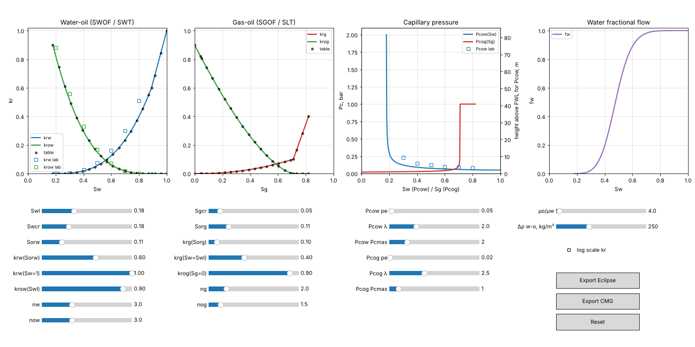
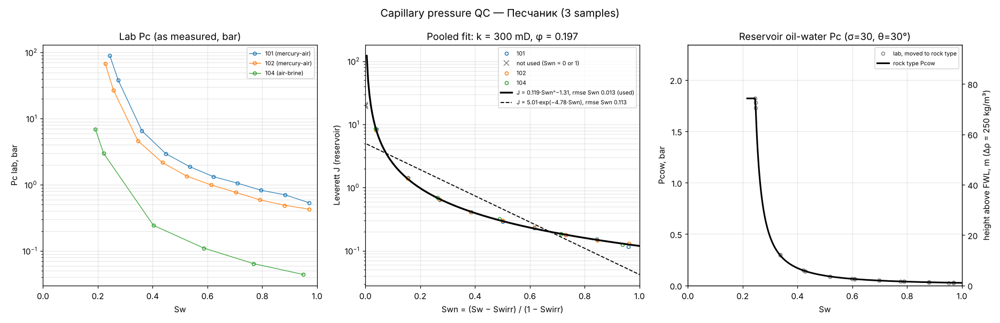
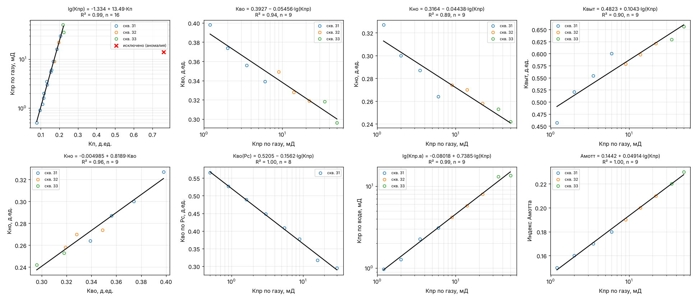
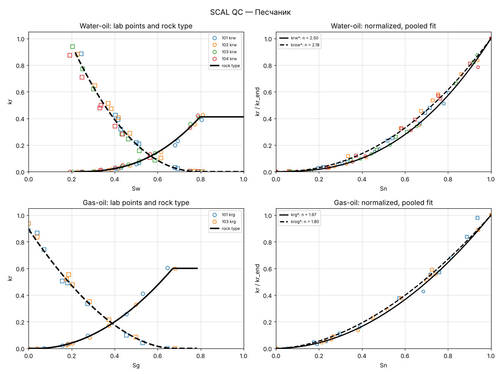

# relperm — интерактивные ОФП и Pc для Eclipse, tNavigator и Petrel

Строит кривые относительной фазовой проницаемости (ОФП: Corey / LET) и капиллярного давления
(Brooks–Corey / J-функция Леверетта) для систем вода–нефть и газ–нефть — вручную или
**прямо из отчёта по специальным исследованиям керна (SCAL)**,
даёт крутить все параметры ползунками и выгружает готовые таблицы для симуляторов:

| Формат        | Ключевые слова              | Где работает                       |
|---------------|-----------------------------|------------------------------------|
| `eclipse`     | `SWOF` + `SGOF`             | Eclipse 100/300, tNavigator, OPM Flow |
| `eclipse2`    | `SWFN` + `SGFN` + `SOF3`    | Eclipse (family II), tNavigator, OPM  |

Файл `.inc` подключается в секцию `PROPS` через `INCLUDE` (Eclipse, tNavigator) или импортируется в Petrel
(Import file → тип файла Eclipse keywords) как функции насыщенности.



Идея взята из скрипта [MouinAlmasoodi/Interactive_Relative_Permeability](https://github.com/MouinAlmasoodi/Interactive_Relative_Permeability)
(Mouin Almasoodi, PhD) и переписана в виде пакета.

## Установка

```bash
pip install -e .          # numpy + matplotlib
pip install -e ".[scal]"  # + pandas, openpyxl — для импорта SCAL из Excel/CSV
pip install -e ".[test]"  # + pytest
```

## Как пользоваться (без командной строки)

1. Один раз установить: в папке с программой `pip install -e ".[scal]"`.
2. Запустить двойным кликом **`Запустить relperm.bat`** (или `relperm` / `relperm-gui` в консоли).
3. В окне нажать **«Открыть отчёт керна…»**, выбрать Excel, в диалоге указать единицы Pc,
   флюиды в лаборатории, группировку (все вместе / по скважинам / по горизонтам / по типу пород) и Δρ.
4. Программа построит типы пород и покажет кривые вместе с точками керна. Кнопка **«Тип пород ▶»**
   листает типы пород. Рядом с отчётом появится папка `<имя отчёта>_relperm` со `scal_report.xlsx`,
   графиками и `relperm_eclipse.inc` (SWOF/SGOF по всем типам пород).
5. Ползунками можно подправить кривые и сохранить текущий тип пород кнопками экспорта.
   **«Открыть .json…»** загружает сохранённые типы пород (`rock_types.json`).

## ОФП из специальных исследований керна (SCAL)

```bash
relperm scal отчёт_ОФП.xlsx -o scal_out -f eclipse
relperm scal отчёт.xlsx --pc-lab-units MPa --pc-system oil-brine --drho 472 --group-by well
relperm scal wo.csv go.xlsx --group-by perm --perm-bins 10,100 -f eclipse2
relperm app scal_out/rock_types.json --rock Песчаник --lab-wo scal_out/lab_Песчаник_wo.csv \
    --lab-go scal_out/lab_Песчаник_go.csv --lab-pc scal_out/lab_Песчаник_pc.csv
```

Схема «нормализация → осреднение → денормализация»:

1. **Чтение.** Excel (все листы) и CSV. Строка заголовков ищется сама (титульные строки над таблицей не мешают),
   колонки узнаются по синонимам на русском и английском, хвосты с единицами отбрасываются
   (`Кв`, `Кпр. мД`, `Пористость. доли ед.`, `Проницаемость для газа *10-3 мкм2`, `Котн. воды`, `Pc_Mpa`, …),
   проценты переводятся в доли, десятичная запятая и `;` понимаются. Таблица может быть:
   * **лист на образец** — номер образца берётся из названия листа;
   * **длинной таблицей** с колонкой образца (номер можно писать только в первой строке блока, объединённые ячейки);
   * **листом свойств образцов** — `Кпр` (по газу и по воде), `Кп`, `Кво`, `Кно`, `Квыт`, индекс Амотта,
     горизонт, глубина — всё подтягивается к кривым по номеру образца;
   * **несколько таблиц на одном листе** — например, сводка сверху и кривые ОФП ниже, где номер образца стоит
     только в колонке сводки. Строки-разделители «Скважина №31» задают скважину. Расчётные таблицы без номеров
     образцов рядом с данными пропускаются.

   Номера образцов сравниваются без учёта похожих русских/латинских букв («011004010РT01H» = «011004010РТ01H»),
   приставка «обр.» и хвост «, Кп=…, Кпр=…» отбрасываются.

   Вода–нефть: `Sw` + `krw`/`kro`; газ–нефть: `Sg` + `krg`/`krog`.
2. **По каждому образцу** концевые точки берутся из замеров: `Swl` (или `Кво`), `Sorw = 1 − Sw_max`,
   `krw(Sorw)`, `kro(Swl)`; `Sgcr`, `Sorg = 1 − Swl − Sg_max`, `krg(Sorg)`, `krog(Sg=0)`.
   Показатели Кори подбираются при зафиксированных концевых точках (МНК в линейном пространстве).
3. **По каждому типу пород** (`--group-by`: колонка «тип породы», `horizon`, `well`, классы проницаемости
   `perm --perm-bins 10,100` или всё в один):
   концевые точки осредняются (`--endpoints mean|median`), а показатели подбираются **по всем нормированным
   точкам группы сразу**. `krog(Sg=0)` приравнивается к `krow(Swl)` — это одна и та же kro при Swi
   (отключается `--no-align-kro`).
4. **Корреляции концевых точек с проницаемостью** `Swl = a + b·lg k` и т. д. — пригодятся для масштабирования
   концевых точек (`SWL`, `SOWCR`, … по ячейкам).

### Капиллярное давление из SCAL

Таблицы `Sw` (или насыщенность ртутью `SHg`) + `Pc` читаются из того же отчёта — MICP, центрифуга,
полупроницаемая мембрана. Дальше:

1. **Единицы** берутся из заголовка: `Pc, psi`, `Рк, МПа`, `Pc (kPa)`, `Рк, атм`, `кгс/см2`, `bar`.
   Если в заголовке их нет — `--pc-lab-units` (иначе считается bar, с предупреждением).
2. **Лабораторная система** — из колонки «Система»/«Метод», из названия листа или файла
   («101 MICP», «Рк 202 центрифуга», «ртуть», «газ-вода», «нефть-вода»), иначе `--pc-system`:

   | Система | σ, мН/м | θ | σ·cosθ |
   |---|---|---|---|
   | `mercury-air` (MICP) | 480 | 140° | 367 |
   | `air-brine` (газ–вода: центрифуга, мембрана) | 72 | 0° | 72 |
   | `oil-brine` (нефть/керосин–вода) | 48 | 30° | 42 |

3. **Пересчёт в пласт** (нефть–вода): `Pc_пл = Pc_лаб · (σcosθ)_пл / (σcosθ)_лаб`,
   по умолчанию `--ift-res 30 --theta-res 30`.
4. **J-функция Леверетта** по каждой точке: `J = Pc_пл / (σcosθ)_пл · √(k/φ)` (k и φ — из данных образца)
   против **нормализованной водонасыщенности** `Swn = (Sw − Swirr) / (1 − Swirr)`, где `Swirr` — наименьшая
   Sw этого образца (при максимальном Pc).
5. **Подгонка по всем образцам типа пород сразу**, две формы (`--j-form auto|power|exp`, по умолчанию берётся лучшая):

   | Форма | Формула |
   |---|---|
   | `exp` | `J = a·exp(−b·Swn)` |
   | `power` | `J = a·Swn^(−b)` (ограничивается `Pcmax` — по самой высокой измеренной точке) |

   Подгонка минимизирует ошибку **по насыщенности** (Swn от ln J): в лаборатории задаётся давление, а измеряется
   Sw, и модель должна воспроизвести распределение насыщенности. В тип пород пишется `LeverettJ` со средней
   геометрической k и средней φ группы. Если k/φ нет — подбирается Brooks–Corey прямо по пластовому Pc.
6. Точки с `Swn = 0` (сама Swirr) и `Swn = 1` в подгонку не идут — на графике отмечены «×».

В сводке для каждого типа пород печатается давление входа и **высота ВНК над ЗСВ** (`--drho`, кг/м³):

```
Capillary pressure, reservoir oil-water (sigma=30 mN/m, theta=30 deg), units bar:
  RT1            8 samples  Leverett J (exp), k = 3.88 mD, phi = 0.142, Pcmax = -; entry 0.05678 -> 1.2 m above FWL
      J = 0.1443*Swn^-1.47           rmse(Swn) = 0.095, 71 points
      J = 6.698*exp(-5.229*Swn)      rmse(Swn) = 0.020, 71 points  <- used
```



Слева — сырые лабораторные кривые, в центре — они же в координатах J–Swn (обе формы, выбранная — сплошной
линией), справа — Pcow типа пород и лабораторные точки, перенесённые на него, с осью высоты над ЗСВ.
Если образцов больше десяти, точки раскрашены по проницаемости.

### Зависимости

По всем листам собирается одна таблица свойств на образец, и по ней строятся зависимости (линейная регрессия,
где нужно — по lg k):

| Зависимость | Вид |
|---|---|
| Кп–Кпр | `lg Кпр = a + b·Кп` |
| Кво, Кно, Квыт, krw(Кно), nw, no, индекс Амотта | `y = a + b·lg Кпр` |
| Кно–Кво | `Кно = a + b·Кво` |
| Кво по капиллярке | `Кво(Pc) = a + b·lg Кпр` |
| Кпр по воде – по газу | `lg Кпр.в = a + b·lg Кпр` |

Для каждой зависимости берётся проницаемость (по газу или по воде), с которой больше точек. Постоянные величины
(например, `kro(Кво) = 1` во всём отчёте) пропускаются.

**Проверка данных** — подозрительные значения выводятся и **не участвуют в подгонке**, на графиках они
отмечены красным крестом:
* одно и то же свойство образца по-разному на разных листах (больше 10%);
* пористость вне 0.01–0.45 (опечатка или проценты вместо долей);
* проницаемость по воде больше, чем по газу;
* `Кво + Кно ≥ 0.95`, значения вне 0–1.



Всё собирается в **`scal_report.xlsx`** — листы «Образцы», «Зависимости», «Аномалии»,
«ОФП нормированные» (`Swn = (Sw − Кво)/(1 − Кво − Кно)`, `krw/krw(Кно)`, `kro/kro(Кво)`),
«Кап. давление» (`Swn`, Pc лаб., Pc пласт., J), «J-функция», «Типы пород».

Что появится в `scal_out/`:

| Файл | Что внутри |
|---|---|
| `rock_types.json` | типы пород — открывается в `relperm app` / `relperm export` |
| `samples.csv` | по образцам: концевые точки, показатели, RMSE, замечания |
| `correlations.csv`, `endpoints_vs_perm.png` | концевые точки vs lg k |
| `qc_<тип>.png` | замеры + кривая типа пород, нормированные точки + подбор |
| `qc_pc_<тип>.png` | Pc: лабораторные кривые, J-функция с подбором, пластовая Pcow + высота над ЗСВ |
| `lab_<тип>_wo.csv`, `lab_<тип>_go.csv`, `lab_<тип>_pc.csv` | замеры для наложения в интерактивном окне |
| `scal_report.xlsx` | сводный отчёт в Excel (см. «Зависимости») |
| `properties.csv`, `dependencies.csv`, `anomalies.csv`, `dependencies.png` | таблица свойств, зависимости, аномалии |
| `relperm_<формат>.inc` | таблицы для симулятора (с `-f`) |



Примеры (все данные синтетические):
* [`examples/scal_report_ru.xlsx`](examples/scal_report_ru.xlsx) — в раскладке типового отчёта керновой
  лаборатории: листы «капл давл», «ОФП» (сводка + кривые на одном листе), «Коэф.вытес.», «смачив.»,
  объединённые ячейки, Pc в МПа без единиц в заголовке
  (`relperm scal examples/scal_report_ru.xlsx --pc-lab-units MPa --pc-system oil-brine`);
* [`examples/scal_lab_report.xlsx`](examples/scal_lab_report.xlsx) — лист на образец, 2 типа пород,
  Pc из MICP в psi, центрифуги в МПа и мембраны в атм;
* [`examples/scal_water_oil.csv`](examples/scal_water_oil.csv) — длинная таблица.

Замечания, которые выводит программа:
* `kro(Swl) ~ 1` — ОФП, скорее всего, нормированы на фазовую проницаемость по нефти при Swi, а не на абсолютную.
  Для симулятора нужна нормировка на ту же k, что в модели (PERMX), — поправьте `krocw`/`krwr`.
* Первая точка Sw выше Кво — `kro(Swl)` взята по первой точке, без экстраполяции.

## Быстрый старт

```bash
relperm template -o my_field.json                      # шаблон конфига
relperm app my_field.json                              # интерактивный редактор
relperm app my_field.json --rock SAND --lab-wo examples/lab_water_oil.csv   # + керновые точки
relperm export my_field.json -f eclipse -o relperm.inc # SWOF/SGOF для всех типов пород
relperm export my_field.json -f eclipse2 -o relperm2.inc # SWFN/SGFN/SOF3
relperm plot my_field.json --log -o curves.png         # картинка для отчёта
```

Пример конфига с двумя типами пород (SATNUM 1, 2) — [`examples/two_rock_types.json`](examples/two_rock_types.json).
Порядок `rock_types` = номер таблицы `SATNUM`.

### Интерактивный редактор

* ползунки на все насыщенности, концевые точки и показатели Кори (в оригинале — только `Krg` и `ng`);
* точки, которые реально попадут в таблицу симулятора, видны поверх кривых;
* панель Pc с правой осью «высота над ЗСВ (FWL)» для Pcow при заданной `Δρ` — переходная зона видна сразу;
* лог-шкала по kr — удобно смотреть «хвосты» krw/krow при адаптации;
* кривая доли воды `fw(Sw)` с ползунком `μo/μw` — сразу видно, как форма ОФП влияет на фронт Баклея–Леверетта;
* недопустимые комбинации (например `Swcr < Swl`) подсвечиваются красным и не ломают график;
* кнопки **Export SWOF/SGOF** и **Export SWFN/SGFN/SOF3** пишут `<имя>_eclipse.inc` и `<имя>_eclipse2.inc`.

## Капиллярное давление

Задаётся в конфиге типа пород полями `pcow` / `pcog` (без них Pc = 0, как раньше) и единицами `pc_units`:
`bar` (METRIC), `psi` (FIELD), `atm`, `kPa`, `MPa`.

```json
"pc_units": "bar",
"pcow": {"model": "brooks-corey", "pe": 0.05, "lam": 2.0, "pcmax": 2.0},
"pcog": {"model": "leverett", "a": 0.25, "b": 1.2, "perm": 15, "poro": 0.17,
         "ift": 25, "theta": 0, "pcmax": 5.0}
```

| Модель | Формула | Параметры |
|---|---|---|
| `brooks-corey` | `Pc = pe · Sn^(−1/λ)` | `pe` — давление входа, `lam` — λ, `pcmax` — ограничение |
| `leverett` | `J = a · Sn^(−b)` или `a · exp(−b·Sn)` (`"form": "exp"`), `Pc = J · σ·cosθ / √(k/φ)` | `a, b`; `perm` (мД), `poro`, `ift` σ (мН/м), `theta` (°), `pcmax`, `form` |

* `Pcow` — кривая первичного дренирования: `Swn = (Sw − Swl) / (1 − Swl)`; `Pcog` — по жидкости
  `Sn = (Sl − Swl − Sorg) / (1 − Sgl − Swl − Sorg)`, `Sl = 1 − Sg`.
* При `Sn → 0` Pc уходит в бесконечность, поэтому ограничивается `pcmax`; без него Sn не опускается ниже 0.01.
* При `Sn = 1` Pc равно давлению входа — значит, ВНК лежит выше ЗСВ на `pe / (Δρ·g)`. Это физично,
  но помните об этом, когда задаёте глубины в `EQUIL`. Если нужен ВНК = ЗСВ, ставьте `pe = 0`.
* J-функция Леверетта удобна для нескольких классов проницаемости: одна кривая J, разные `perm`/`poro`
  в каждом типе пород — и Pc масштабируется сам.
* Таблицы монотонны, как требует Eclipse: Pcow не растёт с Sw, Pcog не убывает с Sg.

## Подбор по керну

Линейная регрессия в лог-координатах (`ln kr = ln kr_max + n·ln Sn`), без scipy.
Brooks–Corey подбирается так же: `ln Pc = ln pe − (1/λ)·ln Sn`.

```bash
relperm fit examples/lab_water_oil.csv --phase ow --swl 0.2 --sorw 0.15
# kr_max = 0.8796, n = 2.629, RMSE = 0.003659 (6 points)
relperm fit lab.csv --phase w --swcr 0.2 --sorw 0.15 --krmax 0.45   # фиксировать концевую точку
```

```bash
relperm fit examples/lab_water_oil.csv --phase pcow --swl 0.2 --sorw 0.15
# pe = 0.07963, lam = 1.779, RMSE = 0.002532 (6 points)
```

`--phase`: `w`=krw, `ow`=krow, `g`=krg, `og`=krog, `pcow`, `pcog`. CSV может быть с `,` или `;` (и десятичной запятой).
Колонки по умолчанию: `Sw, krw, krow, Pcow` / `Sg, krg, krog, Pcog` (другие имена — через `--s-col`, `--kr-col`).
Если в CSV для `--lab-wo` есть колонка `Pcow`, точки появятся и на панели Pc.

### Python API

```python
from relperm import RockType, LET, BrooksCorey, LeverettJ, export

rt = RockType(name="SAND", swl=0.18, swcr=0.2, sowcr=0.11, krwr=0.6, krwmax=1.0,
              nw=3, now=LET(L=2.5, E=1.2, T=1.5),
              pc_units="bar", pcow=BrooksCorey(pe=0.05, lam=2.0, pcmax=2.0))
rt.water_oil_table(points=25)        # dict Sw, krw, krow, Pcow
rt.pc_ow(0.3), rt.pc_og(0.2)         # Pcow(Sw), Pcog(Sg)
rt.height_above_fwl(0.3, drho=250)   # на какой высоте над ЗСВ Sw = 0.3, м
rt.kro_stone2(sw=0.4, sg=0.2)        # трёхфазная kro, нормированный Stone II
rt.fractional_flow(0.5, mu_w=0.4, mu_o=3.0)
print(export([rt], "eclipse"))
```

## Модель

Насыщенности названы как в Eclipse (`SWL, SWCR, SOWCR, SGL, SGCR, SOGCR`):

```
krw  = krwr   · Sn^nw,  Sn = (Sw − Swcr)          / (1 − Swcr − Sorw)
krow = krocw  · Sn^now, Sn = (1 − Sw − Sorw)      / (1 − Swl − Sorw)
krg  = krgr   · Sn^ng,  Sn = (Sg − Sgcr)          / (1 − Sgcr − Swl − Sorg)
krog = krogcg · Sn^nog, Sn = (1 − Sg − Swl − Sorg) / (1 − Sgl − Swl − Sorg)
```

* Выше `1 − Sorw` krw линейно растёт до `krwmax` при Sw = 1 (аналогично krg до `krgmax` при Sg = 1 − Swl).
  По умолчанию `krwmax = krwr`, `krgmax = krgr`.
* Любой показатель (`nw, now, ng, nog`) можно заменить на LET: `{"L": 2, "E": 1.5, "T": 1.2}`.
* Критические насыщенности всегда добавляются в таблицу как узлы — симулятор не «размажет» точку начала течения.

## Что исправлено относительно оригинального скрипта

1. **Экспорта не было вовсе**, хотя README его обещал — теперь SWOF/SGOF и SWFN/SGFN/SOF3, несколько типов пород.
2. `(отрицательное число) ** n` давало NaN/отрицательные kr у остаточной нефти; это лечилось ручным
   `SWT['Krow'].iloc[-1] = 0` (chained assignment, в pandas ≥ 3 молча не работает). Теперь нормированная насыщенность обрезается в [0, 1].
3. SWOF начинался с захардкоженного `0.18` и заканчивался на `1 − Sorw`; Eclipse ждёт таблицу от `Swl` до 1, SGOF — от 0 до `1 − Swl`.
4. `Swcon` и `Swcrit` были склеены в одну переменную — теперь это разные параметры (`swl`, `swcr`).
5. Проверка согласованности: `krow(Swl)` должно равняться `krog(Sg=0)`, иначе Eclipse ругается при Stone — выводится предупреждение.
6. Капиллярное давление: в оригинале колонки Pc не было вовсе, теперь Brooks–Corey и J-функция Леверетта.
7. Валидация входных данных с понятными сообщениями, тесты (`pytest`), CI на GitHub Actions.

## Тесты

```bash
python -m pytest -q
```
